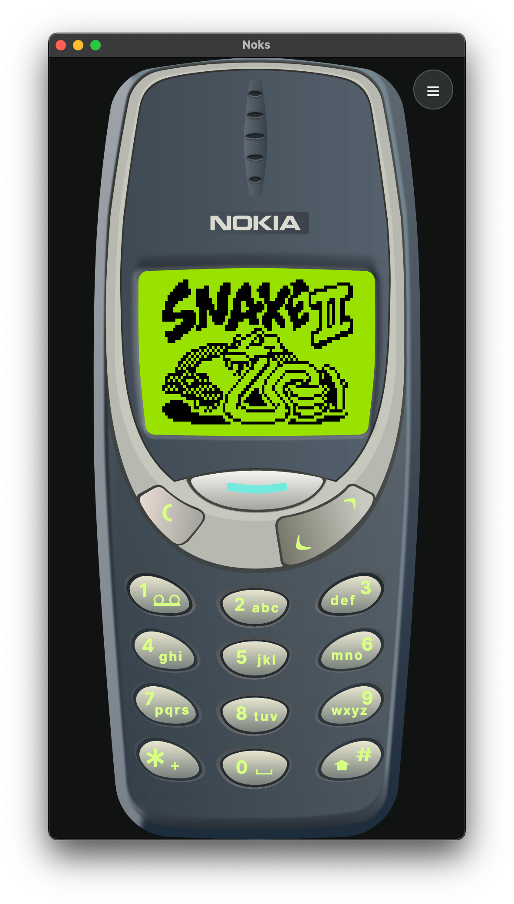
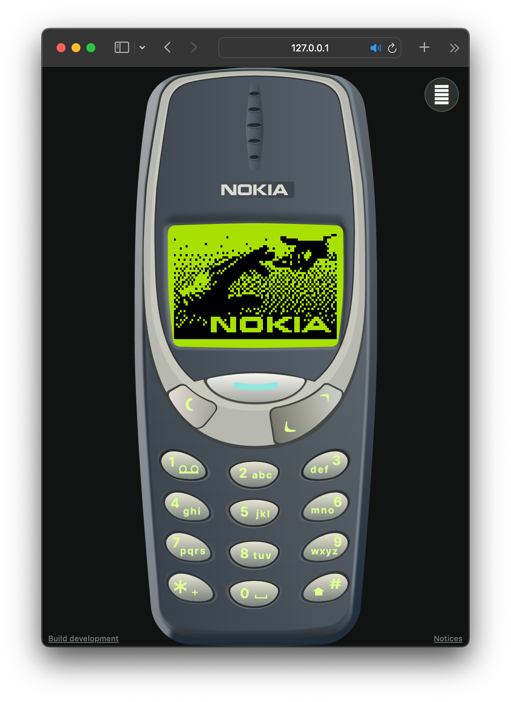

# Noks

Noks emulates the Nokia 3310, a DCT3 handset, in C# on Avalonia and .NET 10. Try it in the browser at [noks.vercel.app](https://noks.vercel.app/).

| Desktop | Browser |
| --- | --- |
|  |  |

Noks ships no Nokia firmware. To boot a handset you supply your own `.fls` flash dump. See [`3310/README.md`](3310/README.md).

## Build

```sh
dotnet build Noks.slnx -c Release
```

## Run

The desktop app shows the live LCD. Pass a dump as the first argument. At startup it looks up your country over the network to pick a plausible operator, so add `--no-ip-operator` to keep it offline.

```sh
dotnet run --project src/Noks.Avalonia -c Release -- path/to/dump.fls
```

The CLI boots the same dump in a terminal and draws the LCD as braille graphics. Run it with `--help` for the full set of trace, keypad, patching, and conversion options.

```sh
dotnet run --project src/Noks.Cli -c Release -- run path/to/dump.fls
```

## Test

`noks sst` runs the ARM7TDMI corpus, which sits in a shallow submodule. Fetch it once, then run the suite.

```sh
git submodule update --init external/ARM7TDMI
dotnet run --project src/Noks.Cli -c Release -- sst
```

The unit tests need no submodule.

```sh
dotnet test Noks.slnx -c Release
```

## Browser build

This builds the threaded Release AOT WebAssembly site and embeds a dump. The runtime needs cross-origin isolation, so the host must send `Cross-Origin-Opener-Policy: same-origin`, `Cross-Origin-Embedder-Policy: require-corp`, and `Cross-Origin-Resource-Policy: same-origin`, and must serve `.wasm` as `application/wasm`.

```sh
node tools/build-browser-release.mjs --firmware path/to/dump.fls --output artifacts/noks-browser-release
```

## Layout

`src/Noks.Cpu` is the ARM7TDMI interpreter. `src/Noks.Dct3` is the DCT3 platform: the MAD2 memory map, the peripherals, the SIM, and the GSM stack. `src/Noks.Cli` is the `noks` tool. `src/Noks.Avalonia` and `src/Noks.Avalonia.Browser` are the desktop and WebAssembly front ends. `src/Noks.Cryptography` and `src/Noks.Waku` carry the post-quantum messaging transport. Test projects sit beside the project they cover, as `<Project>.Tests`.

[`docs/gsm`](docs/gsm) records the specifications the GSM stack implements and the coverage it claims.

## License

MIT, see [`LICENSE`](LICENSE). The grant covers Noks code only, not the vendored third-party code and not Nokia firmware. [`THIRD_PARTY_NOTICES.txt`](THIRD_PARTY_NOTICES.txt) lists every third-party component and its terms. [`TRADEMARKS.md`](TRADEMARKS.md) records the trademark position: Noks is not affiliated with or endorsed by Nokia Corporation.
